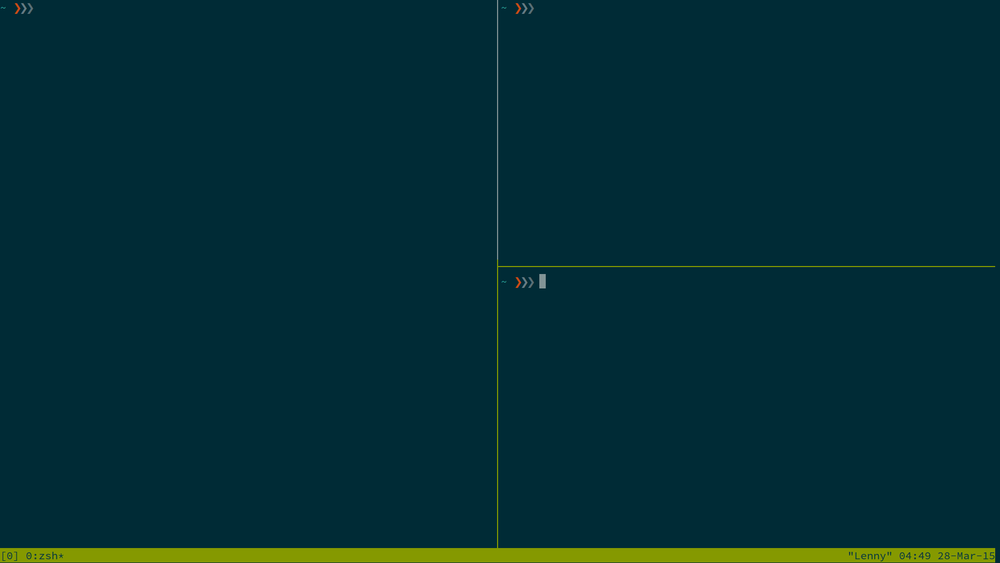

# Scripts
#### Installation
Run this command to hide the script folder after you clone it! Also needed if you want to copy the aliases verbatim.

`$ mv Scripts ~/.scripts`

#### Aliases
Here are the aliases I use in my shell to utilize these scripts. This allows you to save this folder wherever you want. Just modify the path if you dont clone to your home directory.
````
alias tmpc='source ~/.scripts/CTemplate.sh'
alias tdev='source ~/.scripts/tmux-dev.sh'
alias project='source ~/.scripts/ProjectLayout.sh'
alias mdtopdf='source ~/.scripts/MDtoPDF.sh'
````

#### MDtoPDF
MDtoPDF Uses **grip** and **wkhtmltopdf** to convert a markdown file into a github markdown style pdf file.

This script uses grip to export the markdown file to an html file, then it uses wkhtmltopdf to convert the html file to a pdf. It takes a little time to convert to PDF, but is a lot simpler than having to open up chrome.

* https://github.com/joeyespo/grip 
Install (Requires Python):
`$ sudo pip install grip`
* http://wkhtmltopdf.org/
Install:
`$ sudo apt-get install wkhtmltopdf`

#### ProjectLayout.sh
Creates a file system structure to begin a project. The Makefile in files/ is really only setup for C at the moment. Edit it based on the project's needs.

#### Tmux-Dev.sh
This is a simple script I made to setup a tmux environment, it looks like this when its running. I usually have code open in vim on the left, a man page or other code open in the bottom right corner, and use the top right for running commands and compiling on the go.


#### CTemplate.sh
This script copies a skeleton C file to either your current directory or one you provide. This could also just be done with a copy alias. I use a script so I can provide a custom file name/directory.
* Usage: `./CTemplate.sh <Directory/Filename>`
